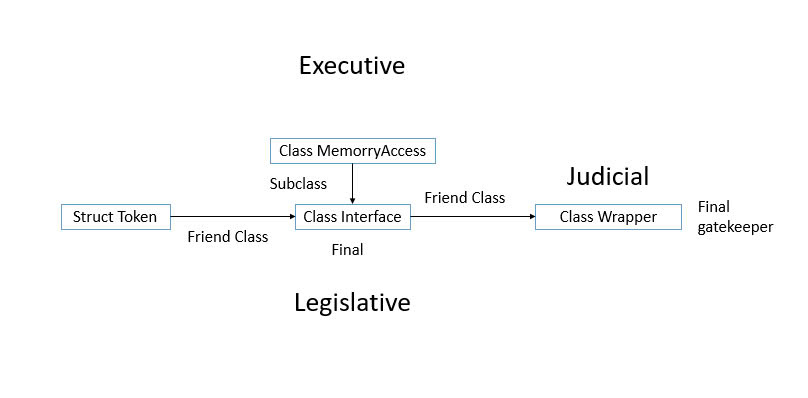

# BioMorphic Instruction Architecture – The Constitutional Kernel (BIA - Paper 3)

This repository contains **Paper 3** in the BioMorphic Instruction Architecture (BIA) series, which introduces a constitutional compile-time sandbox model for software behavior. This model builds a complete behavioral governance system by encoding the **separation of powers** directly into C++ structure.

---

## What This Paper Adds

- Defines the **Constitutional Kernel** – a model where behavior only exists when approved by a lawful chain of compile-time control.
- Introduces the software equivalent of:
  - **Legislative Power:** `Interface` defines tokens and permission.
  - **Judicial Power:** `Wrapper` interprets and verifies requests.
  - **Executive Power:** `MemoryAccess` enforces execution strictly.
- Makes clear: **law in BIA is not a function – it is structure itself.**

---

## Why This Matters

> In typical OOP models, power is centralized and override is unchecked.
>
> In BIA, power is separated and override is illegal unless constitutional.

This makes the system:
- Unforgable: permissions can't be hacked or faked.
- Stateless at runtime: all decisions are made at compile-time.
- Predictable: behavior exists only when explicitly legalized.

---

## Summary of Flow

1. **Label** is issued to describe the intent.
2. **Wrapper** verifies the label and routes it.
3. **Interface** grants or denies a token.
4. **MemoryAccess** acts only on verified tokens.

→ No token = no pointer = no access.

---

## From Sandbox to System Law

Unlike runtime sandboxes, this is a **compile-time legal system**.
Every token is a license.
Every class is limited by structural enforcement.

The system is not just rule-based. It **is** the rule.

---

## System Diagram

The following diagram illustrates the compile-time separation of powers in BIA.

> **Figure 1.** Compile-time separation of powers in BIA.  
> `Interface` (Legislative) defines allowed behaviors, `Wrapper` (Judicial) verifies labels and permissions,  
> and `MemoryAccess` (Executive) executes behavior only under valid token authorization.

---

## License

This repository and paper are licensed under **Creative Commons Attribution 4.0 International (CC-BY 4.0)**.  
© 2025 Nguyen Hong Phuc

