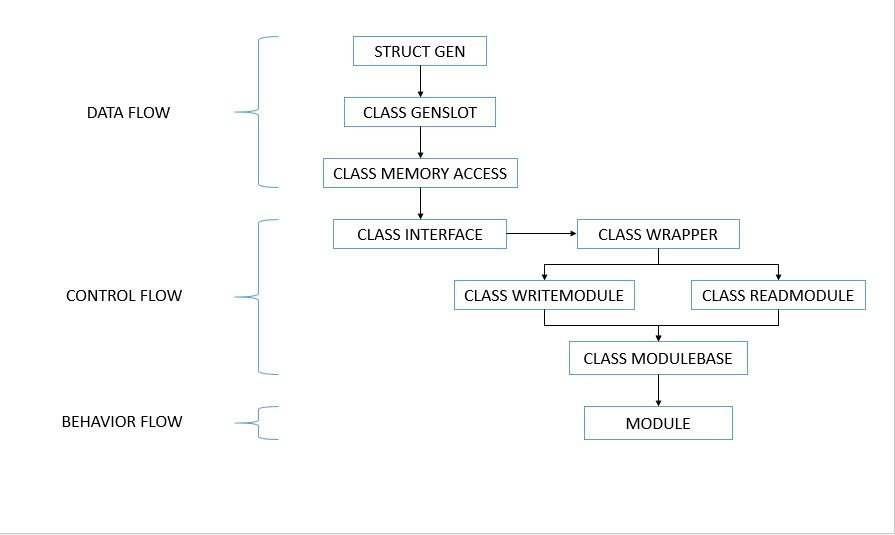

# BioMorphic Instruction Architecture (BIA)

> *“What if every behavior in your code had to be approved like a gene expression in a cell?”*
> *Meet BIA – a strict, beautiful architecture where logic evolves, not explodes.”*

**System Philosophy: Deep Layered Segregation to Enable Controlled Specialization**

**BIA** is an object-oriented programming architecture designed to simulate biological evolution by controlling behavioral expression through compile-time verification in pure C++.

---

## Core Philosophy

> **“Polymorphism is not a right — it is the result of conditional evolution in response to the environment.”**

> **“Not every class deserves to manifest behavior — only those that are decoded and verified.”**

- `struct` acts as the **Genome** — central RAM structure.
- `GenSlot` is the **Nucleus** — protecting access to the genome.
- `Interface` is the **Receptor** — issuing internal permission tokens.
- `Wrapper` is the **Verification Enzyme** — allowing or denying behavior.
- `ReadModule` / `WriteModule` are **Controlled Access Layers**:
  - `ReadModule`: acts as an intracellular sensor, reads only when permitted.
  - `WriteModule`: modifies gene expression under control.
- `ModuleBase` is the **Behavioral Stem Cell** — template awaiting expression.
- `Module` is the **Evolved Form** — the final specialized behavior.

---

## Three Core Layers of BIA

### **1. Data Flow (Genome Layer)**
- `Struct Gen`: Original genome data.
- `GenSlot`: Safely encapsulated RAM (nucleus).
- `MemoryAccess`: Grants safe, controlled access.

### **2. Control Flow (Permission Layer)**
- `Interface`: Checks conditions, generates token.
- `Wrapper`: Verifies token and controls access.
- `ModuleBase`: **Detailed behavior-level verification**:
  - Requires label with: `read/write`, module name, and action type.
  - `Wrapper` + `ModuleBase` coordinate to approve or reject.
  - Invalid labels or overreach → behavior is eliminated.

### **3. Behavior Flow (Execution Layer)**
- `ReadModule` / `WriteModule`: Executes read/write behavior under control.
- `Module`: Final expressed behavior, approved via full pipeline.

> This structure enables **modular behaviors** to be assembled like LEGO blocks — each behavior is independent but governed by strict compile-time logic.

---

## Key Characteristics

- **No token propagation** — permissions are fully internal and inaccessible.
- **No arbitrary overrides** — all behavior is conditionally verified.
- **No raw RAM access** — only `friend` classes may touch data.
- **No runtime plugins** — all behavior is fixed at compile-time.
- **No uncontrolled classes** — behavior only arises through approval.
- **LEGO-style Modularity** — each behavior module is pluggable but regulated.

---

## Practical Applications

- Simulating cell differentiation and signal-controlled behavior.
- Compile-time sandboxing in secure systems.
- Strict logic control in robotics or embedded systems.
- Teaching advanced C++ with biological architecture parallels.
- Behavioral adaptation frameworks in AI or bioinformatics.

---

## Project Status

- [x] Architecture complete
- [x] Multi-layer flow and control design finalized
- [x] Ready for academic documentation
- [ ] Draft SDK prototype (`GenSlot`, `Wrapper`, `ModuleBase`, etc.)
- [ ] Demo evolution modules (e.g., Neuron, ImmuneCell, etc.)
- [ ] Write full whitepaper on gene-behavior mapping logic

---

## Copyright

The **BIA architecture** was designed and published in **2025** by **Nguyen Hong Phuc**, licensed under **CC-BY 4.0**.  
Open for academic and research use with attribution.

> *“BIA is not a framework — it is a logic genome.  
Behavior only expresses if the right evolutionary condition is met.”*
