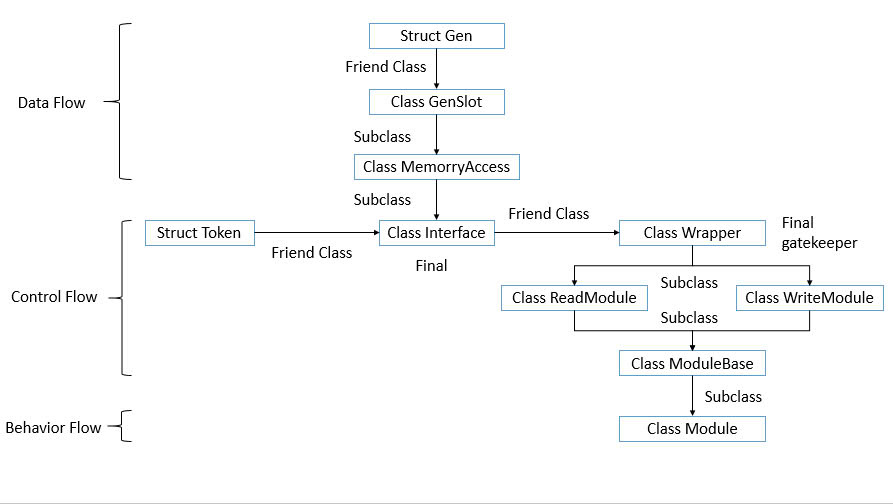

# BioMorphic Instruction Architecture (BIA)

## Overview

**BIA is a compile-time behavior sandbox model** inspired by biological gene expression.  
It enforces memory isolation, token-gated behavior, and pointer-only data access – all at compile-time.

This repository documents the complete structure, rules, and data flow behind BIA.  
You don't need runtime logic or external frameworks.  
**If you understand the diagram, the rules, and the data flow – you can implement or extend BIA safely.**

---
### System Diagram

> **Figure 1.** The compile-time structural pipeline in BIA.

## Contents

### 1. System Diagram  
Visualize the full architecture:  
- Gene struct declaration  
- Memory allocation  
- Token issuance  
- Compile-time behavior routing  
→ Shows `friend` relationships, subclass hierarchy, and trust boundaries.

_See: `/assets/BIA_Diagram.svg`_

---

### 2. Rules of BIA  
Defines the constitutional laws of the system:  
- No behavior without token  
- No memory access without approval  
- No value transmission – only pointer  
- No class may override or access beyond its tier

_See: [`BIA_RULES.md`](./BIA_RULES.md)_

---

### 3. Data Flow Explanation  
Explains how data enters RAM, how it's accessed, and why it's sandboxed at pointer level.  
Includes C++-style examples and compile-safe enforcement.

_See: [`dataflow.md`](./dataflow.md)_

---

## Philosophy

> "No token – no pointer.  
No pointer – no access.  
No access – no behavior.  
No behavior – no override.  
No override – no chaos."  

BIA prevents chaos by design – not by patch.

---

## Author

This system is part of the [BIA Series] published on arXiv and supported by an open model philosophy.  
For inquiries or collaborations, please refer to the publication links or contact the maintainer directly.

---

**Ready to build?**  
Start with understanding the diagram.  
Then read the rules.  
Then follow the data.

Everything else… compiles itself.

---

## License

This work is licensed under **Creative Commons Attribution 4.0 International (CC-BY 4.0)**.  
© 2025 Nguyen Hong Phuc

